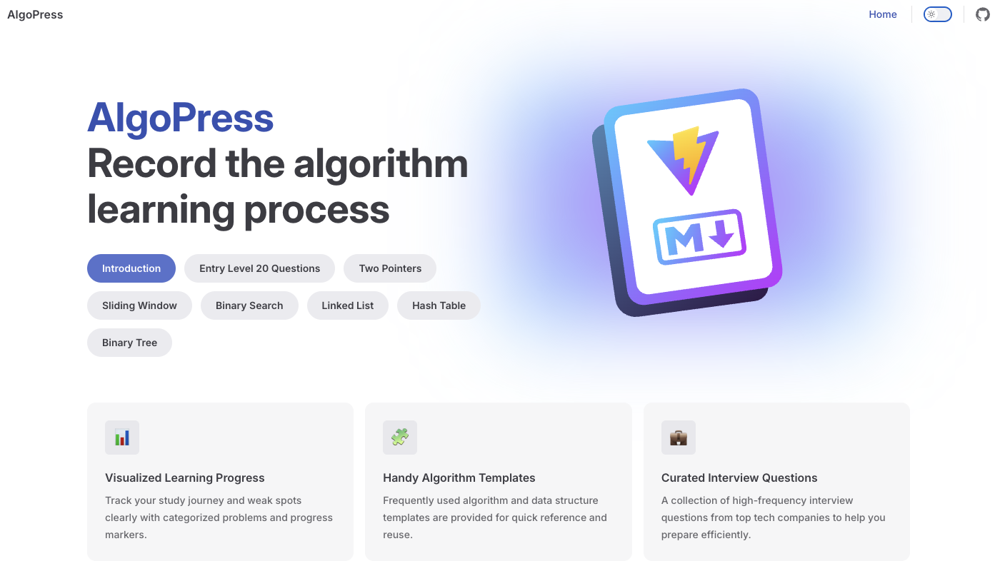
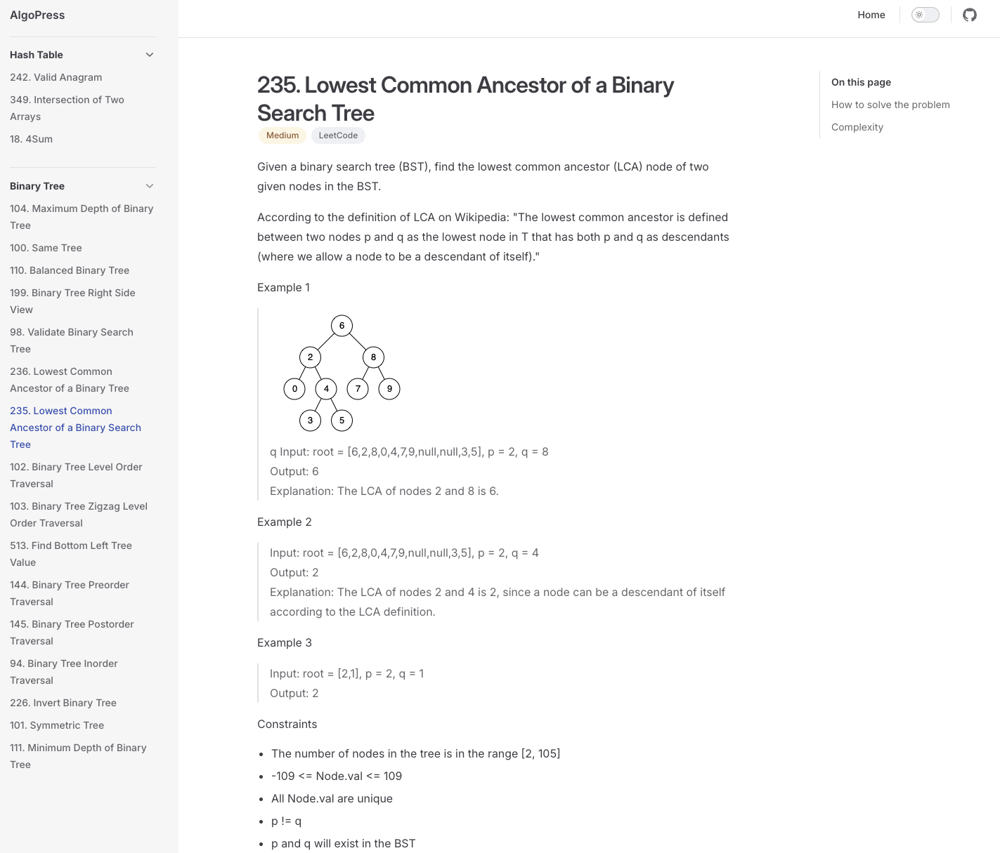

# AlgoPress

This repository contains my solutions to LeetCode problems, organized by different categories and difficulty levels.





## Categories

- [Binary Tree](./docs/Binary-Tree/)
- [Hash Table](./docs/Hash-Table/)
- [Linked List](./docs/Linked-List/)
- [Two Pointers](./docs/Two-Pointers/)
- [Sliding Window](./docs/Sliding-Window/)
- [Binary Search](./docs/Binary-Search/)
- [Entry Level 20 Questions](./docs/Entry-Level-20-Questions/)

## Project Structure

```
docs/
├── Binary-Tree/
├── Hash-Table/
├── Binary-Search/
├── Linked-List/
├── Two-Pointers/
├── Sliding-Window/
├── Entry-Level-20-Questions/
├── images/
└── .vitepress/
```

## Features

- Solutions in Python
- Detailed explanations for each problem
- Multiple approaches when applicable
- Time and space complexity analysis
- Beautiful documentation using VitePress

## Getting Started

1. Clone the repository
2. Install dependencies:
   ```bash
   npm install
   ```
3. Run the development server:
   ```bash
   npm run docs:dev
   ```

## Contributing

Feel free to submit issues and enhancement requests!