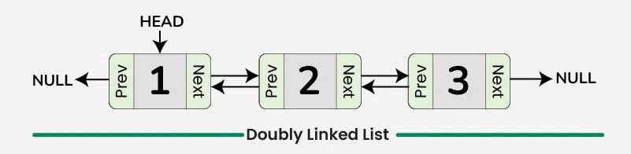

# 146. LRU Cache
<Badge type="warning" text="Medium" />[<Badge type="info" text="LeetCode" />](https://leetcode.com/problems/lru-cache/)

Design a data structure that follows the constraints of a Least Recently Used (LRU) cache.

Implement the `LRUCache` class:
- `LRUCache(int capacity)` initializes the LRU cache with positive size capacity.
- `int get(int key)` returns the value of the key if the key exists, otherwise return -1.
- `void put(int key, int value)` updates the value of the key if the key exists. Otherwise, add the key-value pair to the cache. If the number of keys exceeds the capacity from this operation, evict the least recently used key.

The functions get and put must each run in O(1) average time complexity.

Example 1
> Input: `["LRUCache", "put", "put", "get", "put", "get", "put", "get", "get", "get"]`
> `[[2], [1, 1], [2, 2], [1], [3, 3], [2], [4, 4], [1], [3], [4]]`
>
> Output: `[null, null, null, 1, null, -1, null, -1, 3, 4]`
>
> Explanation: 
> LRUCache lRUCache = new LRUCache(2);
> lRUCache.put(1, 1); // cache is {1=1}
> lRUCache.put(2, 2); // cache is {1=1, 2=2}
> lRUCache.get(1);    // return 1
> lRUCache.put(3, 3); // LRU key was 2, evicts key 2, cache is {1=1, 3=3}
> lRUCache.get(2);    // returns -1 (not found)
> lRUCache.put(4, 4); // LRU key was 1, evicts key 1, cache is {4=4, 3=3}
> lRUCache.get(1);    // return -1 (not found)
> lRUCache.get(3);    // return 3
> lRUCache.get(4);    // return 4

Constraints
- `1 <= capacity <= 3000`
- `0 <= key <= 10^4`
- `0 <= value <= 10^5`
- At most 2 * 10^5 calls will be made to get and put.

## How to solve the problem

- Double Linked List + Dictionary

> 

```python
class LinkedNode:
    def __init__(self, key, value):
        self.key = key
        self.value = value
        self.next = None
        self.prev = None

class LRUCache:
    def __init__(self, capacity: int):
        self.capacity = capacity
        self.cache = {} # dictionary to store key -> LinkedNode

        self.head = LinkedNode(0,0)
        self.tail = LinkedNode(0,0)
        self.head.next = self.tail
        self.tail.prev = self.head

    def get(self, key: int) -> int:
        node = self.cache.get(key)
        if not node:
            return -1
        else:
            self.move_to_front(node) 
            return node.value

    def put(self, key: int, value: int) -> None:
        node = self.cache.get(key)
        if node:
            node.value = value
            self.move_to_front(node)
        else:
            new_node = LinkedNode(key, value)
            self.cache[key] = new_node
            self.add_to_front(new_node)

        if len(self.cache) > self.capacity:
            lru = self.tail.prev
            self.remove(lru)
            del self.cache[lru.key]
    
    def add_to_front(self, node):
        node.prev = self.head
        node.next = self.head.next
        self.head.next.prev = node
        self.head.next = node


    def move_to_front(self, node):
        self.remove(node)
        self.add_to_front(node)

    def remove(self, node):
        node.prev.next = node.next 
        node.next.prev = node.prev
        node.next = None
        node.prev = None

# Your LRUCache object will be instantiated and called as such:
# obj = LRUCache(capacity)
# param_1 = obj.get(key)
# obj.put(key,value)
```

- Built-in OrderedDict

```python
class LRUCache:

    def __init__(self, capacity: int):
        self.capacity = capacity
        self.od = OrderedDict()

    def get(self, key: int) -> int:
        if key not in self.od:
            return -1
        self.od.move_to_end(key ,last=True)  # mark as recently used → move to the end
        return self.od[key]

    def put(self, key: int, value: int) -> None:
        if key in self.od:
            self.od[key] = value # update value
            self.od.move_to_end(key, last=True) # mark as recently used → move to the end
        else:
            self.od[key] = value # insert as new key (added to the end), same as update

        if len(self.od) > self.capacity:
            self.od.popitem(last=False) # evict the least recently used (from the left)


# Your LRUCache object will be instantiated and called as such:
# obj = LRUCache(capacity)
# param_1 = obj.get(key)
# obj.put(key,value)
```

## Complexity

### Double Linked List Approach
- **Time Complexity**: O(1) for both `get` and `put` operations
  - `get`: O(1) for hash map lookup + O(1) for moving node to front
  - `put`: O(1) for hash map operations + O(1) for linked list operations
- **Space Complexity**: O(capacity) for storing the cache entries

### OrderedDict Approach  
- **Time Complexity**: O(1) for both `get` and `put` operations
  - `get`: O(1) for dictionary lookup + O(1) for moving to end
  - `put`: O(1) for dictionary operations + O(1) for moving to end
- **Space Complexity**: O(capacity) for storing the cache entries

Both approaches achieve the required O(1) time complexity for all operations.

